# PROJECT 1
## LAMP STACK IMPLEMENTATION

**STEP1: APACHE INSTALLATION** 

1. Update packages from package manager

`sudo apt update`

2. Run apache2 package installation

`sudo apt install apache2`

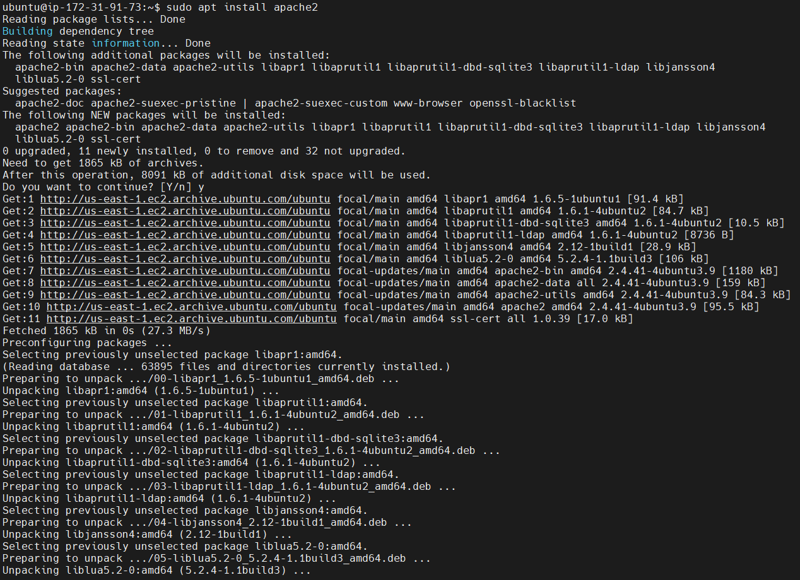

3. Verify Apache2 services are running

`sudo systemctl status apache2`

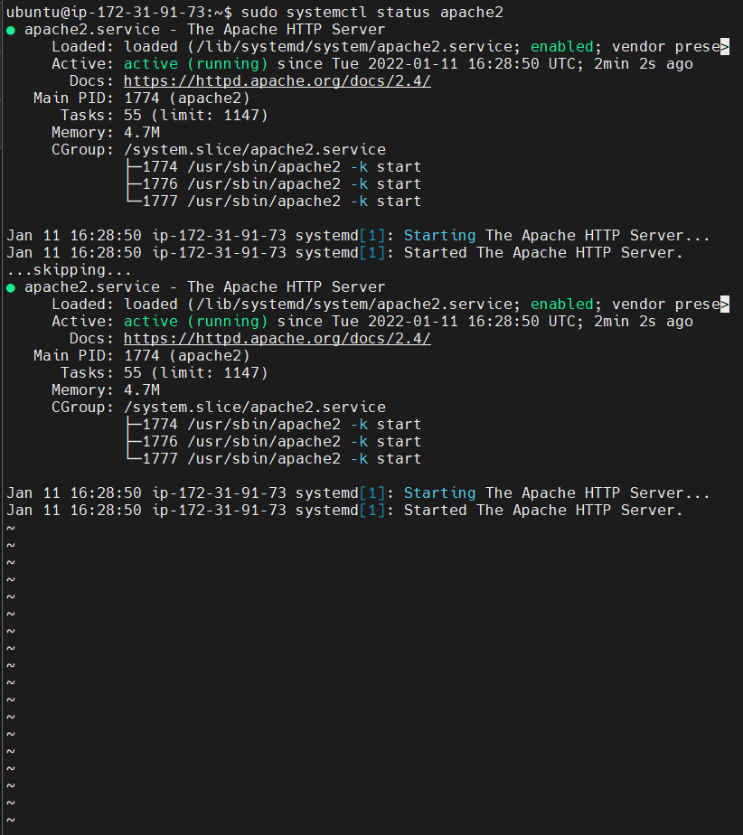

4. add a rule to EC2 configuration to open inbound connection through port 80

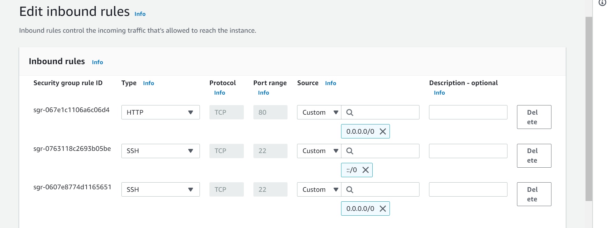

5. Access server locally via DNS

`curl http://localhost:80`

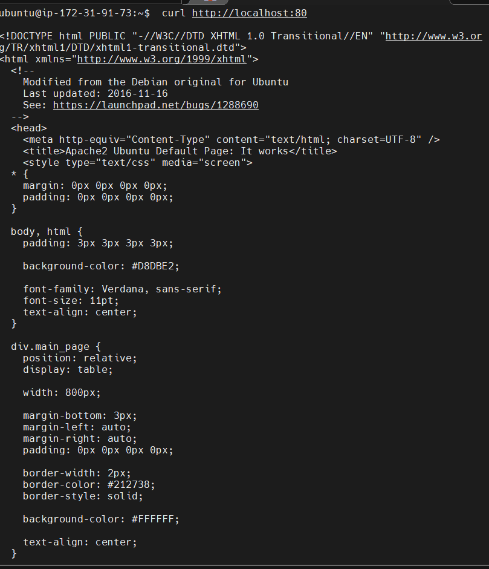

6. Retrieve your Public IP address locally

`curl -s http://169.254.169.254/latest/meta-data/public-ipv4`

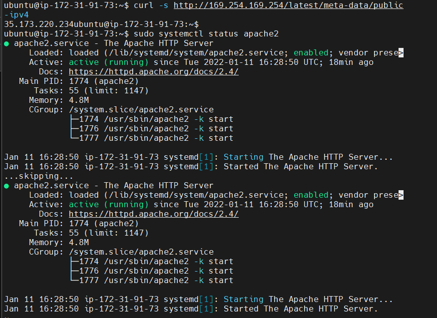

7. Test Apache HTTP server 
using http://<Public-IP-Address>:80
http://<http://35.173.220.234/>:80

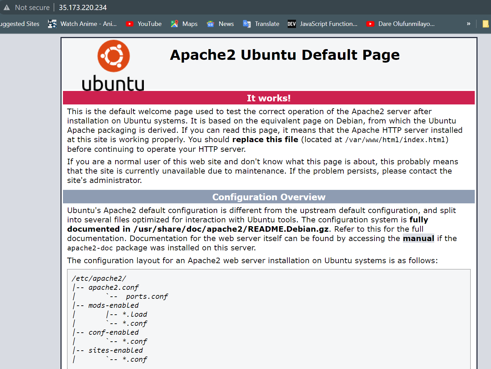

**STEP2: MYSQL INSTALLATION**

1. To acquire and install MYSQL 

`sudo apt install mysql-server`

2. Run secure script

`sudo mysql_secure_installation`

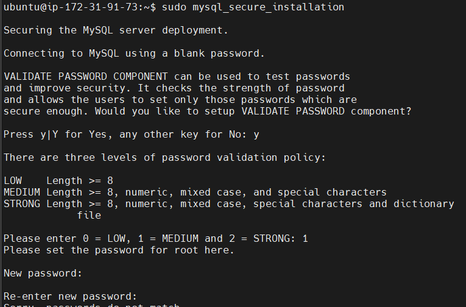

3. Configure password

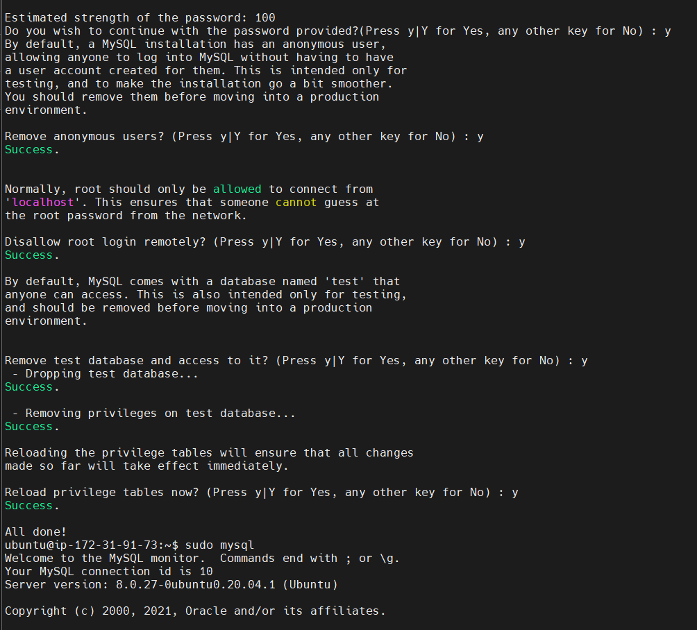

4. Test MYSQL

`sudo mysql`

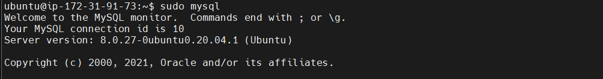

**STEP 3: PHP INSTALLATION**

1. Install PHP packages

`sudo apt install php libapache2-mod-php php-mysql`

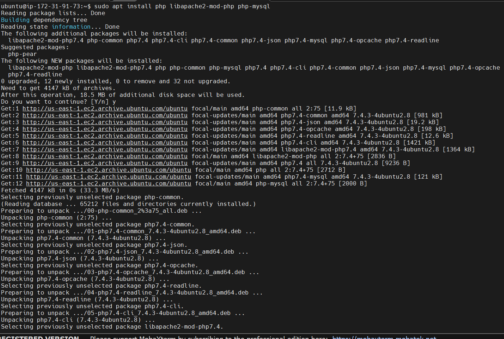

2. Confirm PHP version

`php -v`

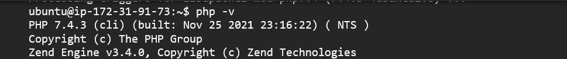

