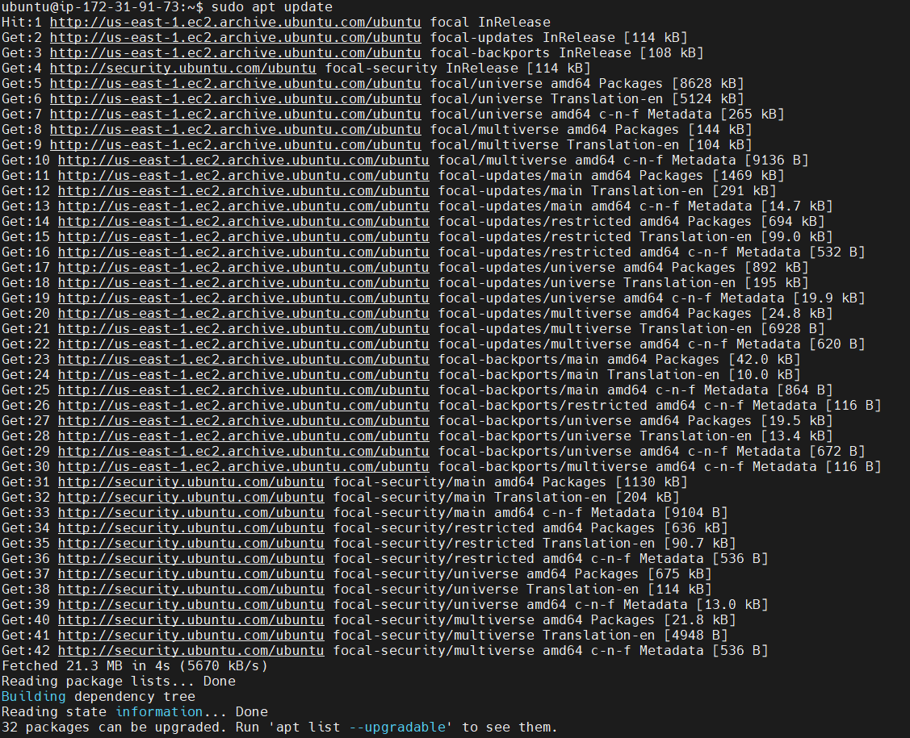

# PROJECT 1
## LAMP STACK IMPLEMENTATION

**STEP1: APACHE INSTALLATION** 

1. Update packages from package manager

`sudo apt update`

2. Run apache2 package installation

`sudo apt install apache2`

3. Verify Apache2 services are running

`sudo systemctl status apache2`

4. add a rule to EC2 configuration to open inbound connection through port 80

5. Access server locally via DNS

`curl http://localhost:80`

6. Retrieve your Public IP address locally

`curl -s http://169.254.169.254/latest/meta-data/public-ipv4`

7. Test Apache HTTP server 
using http://<Public-IP-Address>:80
http://<http://35.173.220.234/>:80

**STEP2: MYSQL INSTALLATION**

1. To acquire and install MYSQL 

`sudo apt install mysql-server`

2. Run secure script

`sudo mysql_secure_installation`

3. Configure password

4. Test MYSQL

`sudo mysql`

**STEP 3: PHP INSTALLATION**

1. Install PHP packages

`sudo apt install php libapache2-mod-php php-mysql`

2. Confirm PHP version

`php -v`

**STEP 4: Create virtual host using Apache2**

1. create directory for domain 
create directory for projectlamp

`sudo mkdir /var/www/projectlamp`

2. Assign ownership of directory with current system

`sudo chown -R $USER:$USER /var/www/projectlamp`

3. create and open a new configuration file in Apache’s sites-available directory using `VI`

`sudo vi /etc/apache2/sites-available/projectlamp.conf`

4. Pasted the below barebones configuration 

5. Use the ls command to show the new file in the sites-available directory

`sudo ls /etc/apache2/sites-available

Apache serves projectlamp using /var/www/projectlampl as its web root directory

6. Enable the new virtual host using a2ensite

`sudo a2ensite projectlamp`

7. Disable Apache’s default website

`sudo a2dissite 000-default`

8. Check for syntax errors

`sudo apache2ctl configtest`

9. Reload Apache2

`sudo systemctl reload apache2`

10. Create an index.html file in that location

`sudo echo 'Hello LAMP from hostname' $(curl -s http://169.254.169.254/latest/meta-data/public-hostname) 'with public IP' $(curl -s http://169.254.169.254/latest/meta-data/public-ipv4) > /var/www/projectlamp/index.html`

OPEN WEBSITE URL

**STEP 5: ENABLING PHP**

1. `sudo vim /etc/apache2/mods-enabled/dir.conf`

 

 2. used the below configuration

 

 3. Reload Apache2
 `sudo systemctl reload apache2`

4. Create a new file named index.php inside your custom web root folder

`vim /var/www/projectlamp/index.php`

5. Use the below configuration

*<?php*

*phpinfo();*

6. Refresh webpage

7. To remove file 

`sudo rm /var/www/projectlamp/index.php`

